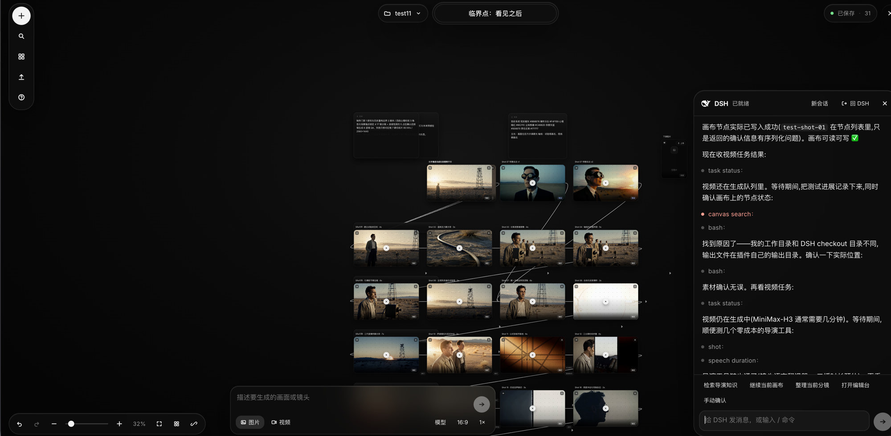
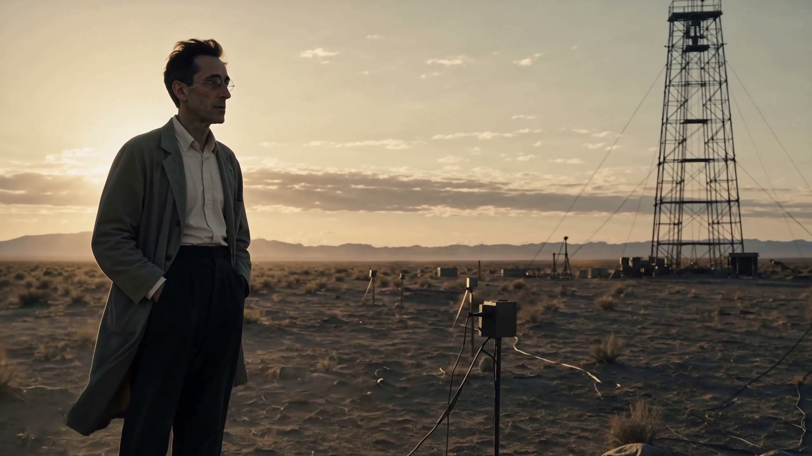

<div align="center">


# DirectorX

**AI video director plugin for DeepSeek Harness**

给 DSH 装上取景器、剪辑台和无限分镜板。大脑仍是 DSH，插件只负责手脚。

<br>

[](https://github.com/LaplaceYoung/dsh-directorx/blob/main/LICENSE)
[](https://github.com/LaplaceYoung/dsh-directorx)
[](https://github.com/LaplaceYoung/dsh-directorx)
[](https://github.com/LaplaceYoung/dsh-directorx)
[](https://github.com/LaplaceYoung/dsh-directorx)

</div>

<br>

<p align="center">
  <a href="#它做什么"><strong>能力</strong></a> ·
  <a href="#成片"><strong>成片</strong></a> ·
  <a href="#快速开始"><strong>安装</strong></a> ·
  <a href="#一次制作怎么走"><strong>流程</strong></a> ·
  <a href="#画布"><strong>画布</strong></a> ·
  <a href="#工具箱里有什么"><strong>工具</strong></a> ·
  <a href="#和别的方案"><strong>对比</strong></a> ·
  <a href="#faq"><strong>FAQ</strong></a> ·
  <a href="#文档"><strong>文档</strong></a>
</p>

<p align="center">
  
</p>

<p align="center">
  <sub>项目「临界点：看见之后」——节点是镜头，连线是承接。右侧 DSH 浮窗绑定当前画布工作区，生成条只投递意图。</sub>
</p>

---

## 它做什么

DirectorX 是 DeepSeek Harness 的 **dsh-plugin**。它不实现第二套 agent loop，也不改画布上的生成节点——DSH 负责想、批、跑；插件提供媒体工具、导演知识、配方和无限画布。

每个项目一份画布。复杂任务先出脚本 / 分镜 / 角色表，**用户确认后再落到画布、再花钱生成**。改时间线是重渲染，不是重新生成：本地 ffmpeg 剪辑、调色、混音、字幕、质检可以无限重跑。

<table>
<tr>
<td width="50%" valign="top">

#### 看

拉片、抽帧、成片质检走确定性 ffmpeg，不靠模型「感觉过了」。

</td>
<td width="50%" valign="top">

#### 拍

图像 / 视频 / 音频生成，首尾帧与角色锚点写进规格。角色设定图走白底胸像 + 正/侧/背三视图。没有 Key 时用 `mock` 先跑通链路。

</td>
</tr>
<tr>
<td width="50%" valign="top">

#### 剪

时间线、智能精剪、混音闪避、字幕。图片 / 视频编辑台 16 套调色（荒土、青橙、漂白、胶片…），自然语言即可打开。

</td>
<td width="50%" valign="top">

#### 排

无限画布是分镜板：16:9 镜头卡、实时连线、⌘K 搜索。UI 只投递意图，节点由 DSH 写。工作区会话浮在画布右侧。

</td>
</tr>
<tr>
<td width="50%" valign="top">

#### 编

`directorx_brief` 给出配方和阶段（plan → create → refine）。成片人格先确认再落板。用现有工具自己串，不必走单一入口。

</td>
<td width="50%" valign="top">

#### 知

351 篇知识库、99 条方法论、12 套配方、39 套主技能。生成前检索，质检引用规则编号。

</td>
</tr>
</table>

---

## 成片

同一块分镜板剪出来的短片。片源 1440p，仓库里是便于浏览的 1080p。GitHub 网页若不内嵌播放，点封面或链接即可打开。

<p align="center">
  <a href="docs/assets/demo.mp4">
    
  </a>
</p>

<video src="docs/assets/demo.mp4" poster="docs/assets/demo-poster.jpg" controls playsinline preload="metadata" width="100%"></video>

<p align="center">
  <sub>《临界点：看见之后》· 约 89 秒 · <a href="docs/assets/demo.mp4">demo.mp4</a></sub>
</p>

---

## 快速开始

需要 **DeepSeek Harness 0.1.0-rc.7+** 的 Web 配置，以及 Node.js 22.19+。

```bash
# 在插件目录里装进 Web 配置
dsh plugin --profile web add .

# 打开 WebUI
dsh web
```

然后打开 **Settings → DirectorX**，四个能力各自开关：Vision / Image / Video / Audio。RC.7 起设置项按命名空间 `directorx` 挂到 Host，不再依赖模型供应商白名单。

| 阶段 | 做什么 |
| --- | --- |
| 现在 | 四个能力都切 `mock`，先把 brief → 确认 → 画布 → 时间线跑通 |
| 有 Key 之后 | 填 Base URL 与 API Key，再开对应能力 |

开发与自测：

```bash
npm test          # typecheck + build + node:test
```

---

## 一次制作怎么走

复杂任务默认 **确认后再落板、占位后再花钱**：先写完整规格（提示词 + 推荐模型 + 画幅/时长），分镜表签字、用户同意落到画布之后，才生成。


简单请求（一张图、一个短镜头）可以直接生成。多镜头、复刻、改编、小说改编走上面这条。

对画布里的 DSH 说「帮我把这张照片调成末日荒土配色」，会走 `directorx_studio`：ffmpeg 套调色、回写节点，并打开对应编辑台。

---

## 画布

画布是分镜文档，不是第二套聊天。每个项目一份 `canvas.json`（OCC 写入），新项目不会混用旧板。

| 谁来做 | 做什么 |
| --- | --- |
| DSH | 想、问、批、写节点、领取生成意图、调色、剪辑 |
| 画布 UI | 看、连、缩放、搜索；底部生成条只 POST 意图 |
| 右侧浮窗 | 当前工作区会话：流式正文、`skill：` 工具行、「思考中」、提问卡、新会话 |

约定：

- 剧本 / 分镜 / 角色表未用 `directorx_confirm`、用户也没说「落到画布」之前，不要批量占位。
- 生成中的节点只能由 DSH 写。UI 不得把卡片标成 generating。
- 角色设定 / 三视图按白底胸像 + 正面 / 侧面 / 背面一次出图。
- 镜头卡按 16:9 横条分镜排布；`canvas_arrange` / `canvas_plan` 走同一套。

快捷键：空白拖移、滚轮缩放、`G` 打开生成条、`⌘K` 搜索节点与命令。双击媒体卡进编辑台。

---

## 工具箱里有什么

90 个 `directorx_*` 工具，按工作面分组：

| 工作面 | 代表工具 | 作用 |
| --- | --- | --- |
| 分诊 | `directorx_brief` / `chengpian` | 类型、平台、时长、澄清问题、是否该确认 / 生成 |
| 镜头 | `directorx_shot` / `shot_sequence` / `shot_gate` | 景别运镜布光 → 提示词；相邻镜承接；生成前门禁 |
| 占位 | `directorx_propose` / `canvas_shotlist` / `directorx_confirm` | 完整规格入队；编号分镜表；DSH 提问卡片签字。人也可 `/directorx` 看制片板 |
| 画布 | `canvas_plan` / `group` / `sequence` / `node` / `intents` | 确认后落板；增删改查、分组、按幕写分镜；领取 UI 意图 |
| 生成 | `generate_image` / `generate_video` / `generate_audio` | 文生图/视频/音频；角色锚点与三视图规格 |
| 剪辑 | `directorx_timeline` / `edit` / `smart_cut` / `studio` | 场景、转场、混音、人话改时间线；打开编辑台并套 16 调色 |
| 质检 | `directorx_qa` / `qa_report` | 时长、画幅、黑场、响度、节奏 |
| 知识 | `directorx_knowledge_search` / `read` | 351 篇语料，按工艺检索 |

视频协议（设置页按能力配置，不绑死一家）：Sora 2、可灵（两代）、Runway、MiniMax H3、Vidu、Veo、Seedance。

---

## 和别的方案

| | 提示词清单 | 剪辑软件 | 成片平台 | **DirectorX** |
| --- | :---: | :---: | :---: | :---: |
| 理解任务 | 靠人 | 否 | 黑盒 | DSH + `brief` |
| 分镜可见、可改 | 否 | 部分 | 少 | 无限画布 |
| 改计划不重花生成费 | — | 是 | 否 | 时间线重渲染 |
| 知识可引用 | 否 | 否 | 否 | 规则编号 + 知识库 |
| agent 归谁 | — | — | 平台 | **始终是 DSH** |

---

## FAQ

<details>
<summary><b>没有 API Key 能用吗？</b></summary>

能。四个能力切 <code>mock</code> 即可跑通工具链、画布和剪辑。有 Key 再回设置页填写。

</details>

<details>
<summary><b>支持哪些视频模型？</b></summary>

Sora 2、可灵（新旧协议）、Runway、MiniMax H3、Vidu、Google Veo、豆包 Seedance。协议按官方文档接入，在 Settings → DirectorX 里按能力配置。

</details>

<details>
<summary><b>多镜头怎么保持同一张脸？</b></summary>

<code>directorx_character_register</code> 注册锚点；生成时带参考图和身份描述。角色设定走三视图。相邻镜头用 <code>shot_sequence</code> 写承接，长片用画布连续性锁。

</details>

<details>
<summary><b>剪辑和调色会花模型钱吗？</b></summary>

不会。剪辑、16 套调色、混音、字幕、质检都是本地 ffmpeg。花钱的只有你确认过的生成占位。

</details>

<details>
<summary><b>必须走 orchestrate 吗？</b></summary>

不必。<code>directorx_brief.compose</code> 给出配方和工具序列，用现有工具自己编排。<code>directorx_orchestrate</code> 只是可选加速。

</details>

<details>
<summary><b>画布上谁写生成中的节点？</b></summary>

只有 DSH。生成条把意图推进 <code>directorx_canvas_intents</code>，DSH 领取后再改画布。UI 不绕过 agent。

</details>

<details>
<summary><b>为什么 DSH 不直接往画布上堆节点？</b></summary>

剧本、分镜、角色表要先和你对齐。<code>directorx_confirm</code> 或你明确说「落到画布」之后，才 <code>canvas_plan</code> / 批量占位。一张图补位可以随时加。

</details>

<details>
<summary><b>画布右侧的会话是另一套 agent 吗？</b></summary>

不是。那是当前工作区绑定的 DSH 会话：流式输出、提问卡、批准、新会话都走官方 Session。插件不另起 loop。

</details>

<details>
<summary><b>要哪一版 DSH？</b></summary>

<strong>0.1.0-rc.7 及以上</strong>。插件同时注册 <code>settings.section</code> 与按命名空间配对的 <code>settings.plugin.item</code>（key=<code>directorx</code>）。

</details>

---

## 文档

| 文档 | 内容 |
| --- | --- |
| [架构](docs/architecture.md) | 插件边界、画布归属、路由 |
| [验证](docs/verification.md) | 测试与验收口径 |
| [Changelog](CHANGELOG.md) | 用户可见变更 |
| [配方](recipes/) | 宣传片 / 改编 / 拉片复刻 / 单元化制作 |

```
dsh-directorx
├── src/           工具、画布、媒体、配方编排
├── skills/        方法论、工坊、novel-* 门禁
├── knowledge/     351 篇导演/生成语料
├── recipes/       内容类型先例（按素材改，不是目录）
├── workflows/     可选并行模板
├── docs/assets/   画布截图与成片演示
└── tests/         node:test
```

---

<div align="center">

Apache-2.0 · [License](https://github.com/LaplaceYoung/dsh-directorx/blob/main/LICENSE)

如果它让 DSH 第一次把一条片子剪完，点个 Star。

</div>
