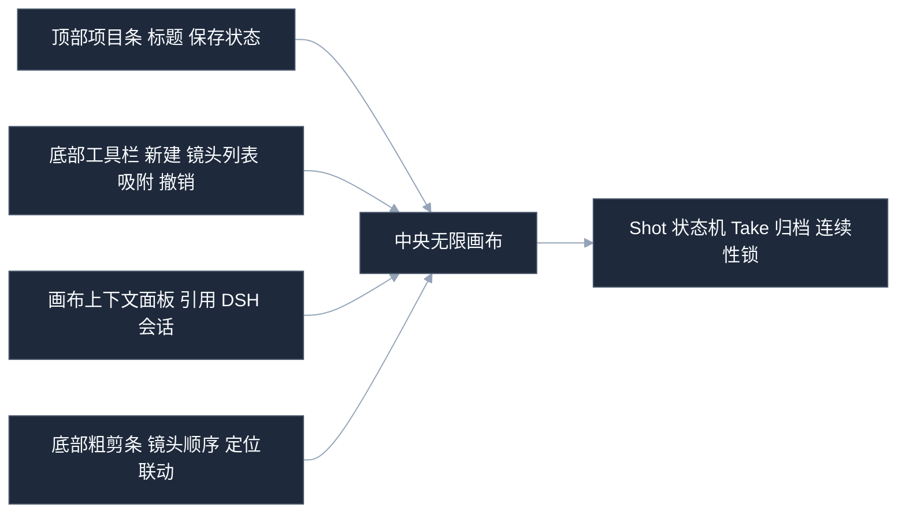

<div align="center">

# dsh-directorx

**DirectorX · AI 视频导演插件**

*给 DeepSeek Harness 装上取景器、剪辑台和分镜板。*

<p>
  <a href="https://github.com/LaplaceYoung/dsh-directorx/blob/main/LICENSE"></a>
  
  
  
  
</p>

**DSH 会写代码，但不会拍片——除非你给它装上这个。**

导演的知识、剪辑的手艺、制片人的流程，压进一个插件：
**生成 · 剪辑 · 质检 · 画布 · 知识库**，一次装齐。

<sub>关键词：AI 视频生成 · 文生视频 · 图生视频 · 智能剪辑 · 视频 agent · 分镜 · storyboard · video agent</sub>

</div>

---

## 它是谁

一个把 DSH 变成「AI 电影导演」的插件。不抢 agent loop，不塞第二套 runtime——
**大脑还是 DSH 的，我们只负责给它装上四肢：**

> **会看** —— 拉片、逐镜描述、成片质检，全部确定性 ffmpeg 驱动，零幻觉。<br>
> **会拍** —— 8 种视频模型协议、首尾帧、角色一致性锚点，一键生成。<br>
> **会剪** —— 时间线渲染、智能精剪、混音、字幕，免费、可无限重跑。<br>
> **会说** —— TTS 旁白带表演指令，音画同出，自动闪避混音。<br>
> **有手艺** —— 99 条方法论规则、350+ 篇知识库，决策与质检都引用规则编号。

**改计划 = 重渲染，永不重新生成、永不重复花钱。**
这句值得再读一遍——这是它和「烧钱抽卡式 AI 工具」的根本区别。

---

## 制作流水线


## 五区画布



---

## 快速开始

```bash
dsh plugin --profile web add .
dsh web
```

打开 WebUI **Settings → DirectorX**，四个能力独立配置。没有 Key 也不慌：
全部切 `mock`，先把工具链跑通，拿到 Key 再填——**先上车，后补票**。

---

## 功能巡礼

**① 意图分诊 —— 先问清楚「想拍什么」**
`directorx_brief` 把你的需求翻译成简报：类型、平台、画幅、时长、风格、角色锚点，外加一份「只问一次」的澄清清单。标题、封面、平台规格卡顺手生成。

**② 镜头语言翻译器 —— 导演话术直接变成提示词**
`directorx_shot` 是表驱动的确定性翻译器：景别、机位、运镜、布光、构图，结构化输入 → 五轴装配提示词 + 负面基线 + 规则编号引用。**不靠感觉写 prompt，靠 99 条规则的沉淀。**

**③ 分镜承接链 —— 相邻镜头不再「各演各的」**
`directorx_shot_sequence` 自动注入承接变量（上镜收于什么、下镜从什么开始）和首尾帧接力计划，反单调运镜校验一条条数给你看。批量生成前还有 `shot_gate` 把关——ECU 惜用律、词表、模型路由，先查再烧钱。

**④ 确定性剪辑台 —— 剪一百遍也不花一分钱**
`directorx_timeline` 是剪辑中枢：场景裁剪、变速、倒放、55 种逐对转场、混音闪避、字幕。改哪层只重渲哪层（场景指纹缓存）。`directorx_edit` 还能听懂人话：「去掉开头两秒」「只保留 3 到 10 秒」「5-8 秒放慢 2 倍」。

**⑤ 成片质检 —— 让数据说话**
`directorx_qa_report` 七门质检 + 帧级抽检，结论直接写成画布上的质检卡。黑场、音量、节奏、ASL……拍完不靠玄学，靠报告。

**⑥ 无限画布 —— 分镜板、版本树、交付记录三合一**
五区布局：顶栏项目条、底部工具与粗剪条、可折叠的上下文面板。Shot 状态机（想法→批准→生成→审阅→锁定）点击即转；Take 归档与连续性锁让长片项目不变成「连线意大利面」。

**⑦ 导演知识包 —— 手艺可以下载**
`directorx-methodology` 技能：99 条可执行规则 / 15 领域；7 个风格语法预设；350+ 篇知识库。每次生成前查一眼，每次质检引用规则编号——**像真导演一样工作，而不是像抽卡玩家。**

---

## 和别的方案比

纯提示词脚手架只能「建议你怎么写」；独立剪辑软件不会「理解你要什么」；商业成片平台把流程装进黑盒。
**dsh-directorx 把三者缝在一起**：DSH 当导演（推导流程），画布当分镜板（全程镜像），ffmpeg 当剪辑台（确定性与免费）。

---

## FAQ

<details>
<summary><b>没有 API Key 能用吗？</b></summary>
能。四个能力都切 <code>mock</code> 跑通链路；拿到 Key 后回设置页填上即可。
</details>

<details>
<summary><b>支持哪些视频模型？</b></summary>
Sora 2、可灵（新旧两代协议）、Runway Gen-4.5、MiniMax H3、Vidu Q3、Google Veo 3.1、豆包 Seedance——协议全部官方文档一手核实。
</details>

<details>
<summary><b>多镜头一致性怎么保证？</b></summary>
<code>directorx_character_register</code> 注册角色锚点，生成时自动注入参考图与身份描述；配方法论规则 7（角色绑定三件套）与规则 63（参考池每 6-8 镜刷新）。
</details>

<details>
<summary><b>剪辑会花 API 钱吗？</b></summary>
不会。所有剪辑、混音、字幕、质检都是本地 ffmpeg 确定性执行——免费、精确、可无限重跑。
</details>

<details>
<summary><b>为什么我的模型不听话？</b></summary>
先让 DSH 查 <code>directorx-methodology</code>，再检查 mode 选对没有。模型不是不听，是嫌提示词不够导演。
</details>

---

<div align="center">

如果这个插件让你的 DSH 第一次说出「导演，这条过了」，请点个 **Star**；
如果它生成了六个手指的超级英雄，也别慌——那是模型在提醒你：先读知识库，再锁提示词。

**Keep prompting. Keep shooting.**

</div>
