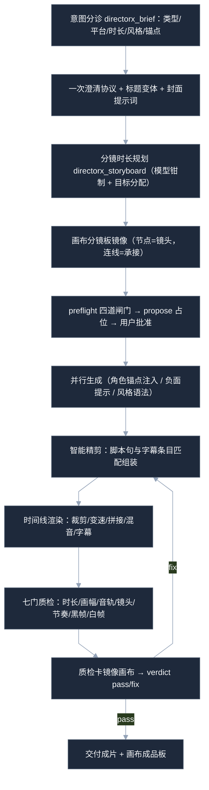
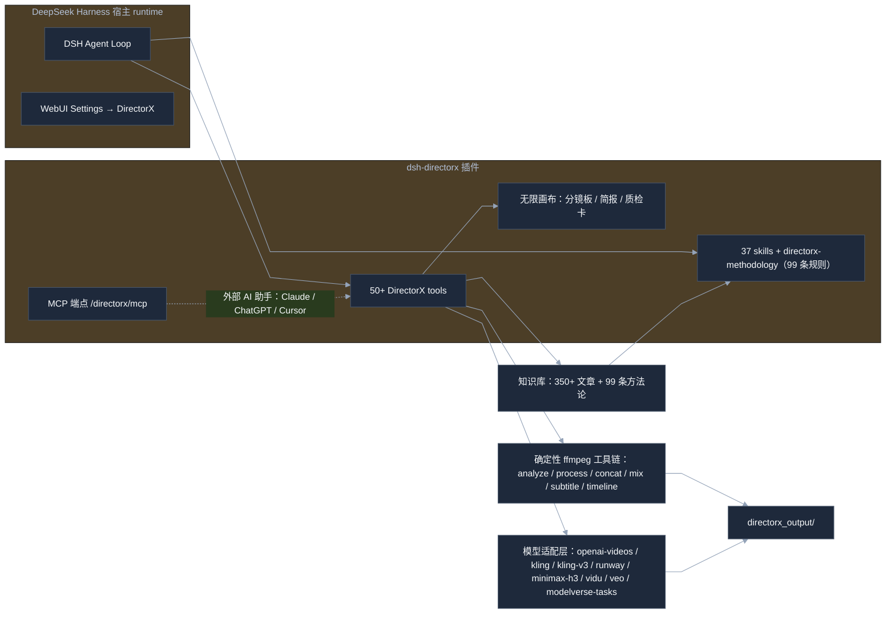

<p align="center">
  <h1 align="center">dsh-directorx</h1>
  <p align="center"><strong>DirectorX — AI 视频导演插件 | AI Film Director Plugin for DeepSeek Harness</strong></p>
  <p align="center">
    把 DeepSeek Harness 从「会写代码的同事」升级成「会拍片的导演」。
    <br/>
    视频生成 · 智能剪辑 · 成片质检 · 无限画布分镜 · 导演知识库，一个插件全搞定。
  </p>
</p>

<p align="center">
  <a href="https://github.com/LaplaceYoung/dsh-directorx/blob/main/LICENSE"></a>
  <a href="https://github.com/LaplaceYoung/dsh-directorx"></a>
  <a href="https://github.com/LaplaceYoung/dsh-directorx"></a>
  
  
</p>

<p align="center">
  <strong>关键词 / Keywords</strong>：AI 视频生成 · 文生视频 · 图生视频 · 智能剪辑 · 视频 agent ·
  text-to-video · AI video generator · video agent · storyboard · dsh-plugin · deepseek-harness · directorx
</p>

<details open>
<summary><strong>目录 / Table of Contents</strong></summary>

- [这到底是个啥](#what-is-this)
- [为什么你可能会喜欢它](#why-youll-like-it)
- [和别的方案比，有什么不一样](#comparison)
- [制作流水线](#pipeline)
- [架构一图流](#architecture)
- [安装：三十秒上桌](#quick-start)
- [工具速查](#tool-cheat-sheet)
- [片场知识包](#knowledge-pack)
- [开发与测试](#development)
- [FAQ](#faq)

</details>

---

<a id="what-is-this"></a>
## 这到底是个啥 / What is this

一句话：**给 DSH 装上影视制作的四肢，而大脑还是 DSH 自己的。**

`dsh-directorx` 是 DeepSeek Harness（DSH）插件。它不抢 agent loop，不塞第二套 runtime；
它只做四件事，外加一座片场：

- **分析视频** —— 分镜检测、逐镜描述、成片质检报告，全是确定性工具（ffmpeg 驱动，零幻觉）；
- **生成画面** —— 文生图 / 文生视频 / 图生视频 / 首尾帧 / 角色一致性锚点；
- **剪辑成片** —— 时间线渲染、智能精剪、卡点混剪、混音、字幕，免费且可重跑；
- **说出声音** —— TTS 旁白、音画同出、自动闪避混音；
- **片场知识包** —— 350+ 篇影视知识库、99 条制作方法论、7 个风格语法预设、37 个技能、11 套 recipe。

> 想找「AI 视频剪辑」？这里有。想找「AI 短视频成片流水线」？这里有。想找「视频 agent 编排」？
> 这里也有——而且所有剪辑都是本地 ffmpeg 确定性执行，改计划 = 重渲染，永不重新生成、永不重复花钱。

<a id="why-youll-like-it"></a>
## 为什么你可能会喜欢它 / Why you'll like it

| 痛点 | 装上之后 |
|---|---|
| 模型只会说「我无法生成视频」 | DSH 会先查知识库，再直接调用视频工具，产出文件路径 |
| Base URL / API Key 藏在 YAML 深处 | 打开 DSH WebUI 设置页，像填外卖地址一样填完即用 |
| 分镜写得像散文 | 内置 99 条方法论会把提示词收紧成可生成、可复用的导演指令 |
| 生图、生视频、配音要装三四个插件 | 一个插件，四类能力，8 种视频模型协议，按需开关 |
| 生成完就完事，质量靠玄学 | 成片质检门（时长/画幅/音轨/节奏/黑帧/白帧）+ 帧级 QA + 画布质检卡 |
| 想做专业项目却没有流程约束 | brief 意图分诊 + 四道闸门 + 提案状态机，先方案后花钱 |

<a id="comparison"></a>
## 和别的方案比，有什么不一样 / Comparison

| 方案 | 生成 | 剪辑 | 质检 | 编排 | 备注 |
|---|---|---|---|---|---|
| 纯提示词脚手架（wrapper 插件） | 支持 | 无 | 无 | 无 | 生成完就交给剪辑软件，链路断在模型门口 |
| 独立剪辑软件（剪映/PR） | 无 | 支持 | 部分 | 无 | 剪辑强，但 agent 进不去，流程靠人手 |
| 商业 AI 成片平台 | 支持 | 黑盒 | 黑盒 | 半自动 | 快，但改一处重新生成、重新计费 |
| **dsh-directorx** | 支持 8 协议 | 确定性可重跑 | 七门+帧级 | agent 自主推导 | 改计划=重渲染，剪辑零 API 成本 |

三个原则：**agent 是导演（推导流程）、画布是分镜板（全程镜像）、ffmpeg 是剪辑台（确定性与免费）**。

<a id="pipeline"></a>
## 制作流水线 / Production Pipeline



<a id="architecture"></a>
## 架构一图流 / Architecture



插件只负责「眼睛、画笔、摄影机、麦克风、剪辑台和片场百科」，调度、审批、会话、subagent 全由 DSH 自己管。

<a id="quick-start"></a>
## 安装：三十秒上桌 / Quick Start

```bash
dsh plugin --profile web add .
dsh web
```

没有构建仪式：`lib/` 已经提交进仓库，安装后直接加载。

打开 DSH WebUI，**Settings → DirectorX**，四个能力各自独立配置：

| 能力 | 工具 | 配置方式 | 模型示例 |
|---|---|---|---|
| 视觉 | `directorx_view_image` | `openai-chat` / `mock` | `gpt-4o-mini`、任意兼容 VLM |
| 图像 | `directorx_generate_image` | `openai-images` / `modelverse-tasks` / `mock` | `gpt-image-1`、`doubao-seedream-*` |
| 视频 | `directorx_generate_video` | `openai-videos` / `modelverse-tasks` / `kling` / `kling-v3` / `runway` / `minimax-h3` / `vidu` / `veo` / `mock` | `sora-2`、`kling-3.0`、`gen4.5`、`MiniMax-H3`、`viduq3`、`veo-3.1` |
| 音频 | `directorx_generate_audio` | `openai-tts` / `mock` | `gpt-4o-mini-tts`（支持 instructions 表演指令） |

保存即热更新，不用重启。没有 Key？切 `mock` 模式，先跑通整条链路再上真模型。

<a id="tool-cheat-sheet"></a>
## 工具速查 / Tool Cheat Sheet

制作四支柱（新增）：

| 工具 | 一句话说明 | 典型用法 |
|---|---|---|
| `directorx_brief` | 意图分诊 → 结构化简报 + 一次澄清 + 标题/封面/平台规格卡 | 每个需求的开局 |
| `directorx_video_analyze` | 分镜检测 + 代表帧 + 响度摘要（确定性拉片） | 剪辑前判断节奏与结构 |
| `directorx_qa` / `_qa_report` | 成片质检七门 + 一键质检卡上画布 | 交付前最后一道门 |
| `directorx_smart_cut` | LLM 精剪：脚本句与字幕条目匹配组装 | 口播精剪、素材定位 |
| `directorx_clip_rank` | 候选片段评分排序（ESA 管线评分步） | 从长素材挑可用镜头 |
| `directorx_timeline` | timeline.json 渲染中枢（裁剪/变速/拼接/混音/字幕） | 改计划=重渲染 |
| `directorx_audio_sync` | 音画同出：旁白边界检测 + 自动混音 + 时间锚点 | 口播成片、卡点对齐 |
| `directorx_storyboard` | 分镜时长规划 + 连续性锚点校验 | 生成前把计划做对 |
| `directorx_character_register/list` | 角色一致性锚点库（参考图+描述注入） | 多镜头锁同一张脸 |
| `directorx_style` | 风格注入：10 预设 slug + 7 个完整语法预设 | 王家卫/韦斯/赛博朋克一键锁风格 |

画布（14 个）：get/add/batch/connect/update/remove/arrange/replace/clear/search/branch/dissolve_group/title/layout_hierarchy —— 无限画布是分镜板、简报板、质检板，DSH 与你在 WebUI 看到同一张生产视图。

其余：`view_image`、`generate_image/video/audio`、`video_process`（含 reverse/freezeEnd）、`video_concat`、`audio_mix`（含 targetLufs）、`video_subtitle`、`video_zoom`、`video_pip`、`audio_beat`、`transcribe_audio`、`probe_media`、`extract_frames`、`preflight`、`propose/proposals/proposal_update`、`task_status/cancel_task`、`edits`、`knowledge_search/read`。

外加 **`/directorx/mcp`**：JSON-RPC 2.0 端点，13 个工具——Claude Desktop / ChatGPT / Cursor 也能驱动这台制片机。

<a id="knowledge-pack"></a>
## 片场知识包 / Knowledge Pack

- **350+ 篇影视/AI 生成知识库**：镜头语言、灯光色彩、提示词工程、模型矩阵、首尾帧控制、短剧工业化、平台交付规格。
- **`directorx-methodology`：99 条可执行规则 / 15 领域**——成片结构、提示词工程、镜头语言、导演技法、剪辑节奏、音频混音、字幕设计、叙事后期、VFX、平台运营、配音表演。每条附来源与工具落点，决策与质检引用规则编号。
- **7 个风格语法预设**：wong-kar-wai / wes-anderson / cyberpunk / noir / documentary / commercial / ghibli —— 锚 + 色盘 + 运动语法 + 负面锁四件套，一次调用锁死质感。
- **37 个 runtime skills + 11 套 recipe + 3 套 workflow 模板**（pipeline / talking-video / montage，dryRun 可零成本验证编排）。

<a id="development"></a>
## 开发与测试 / Development

```bash
npm install
npm run typecheck
npm run build
npm test
```

当前 **72/72 全绿**：模型适配器本地服务器往返测试（8 种视频协议）、确定性剪辑链真实 ffmpeg 往返、画布语义、提案状态机、MCP 契约、方法论校验器。

想连 DSH 一起冒烟：`scripts/dsh-smoke.sh`。

<a id="faq"></a>
## FAQ

**Q：没有 API Key 能用吗？**
能。四个能力都切 `mock`，先让 DSH 把工具链跑起来；拿到 Key 后回设置页填上即可。

**Q：支持哪些视频模型？**
Sora 2（openai-videos）、可灵（kling legacy + kling-v3 新标准）、Runway Gen-4.5、MiniMax H3、Vidu Q3（多主体参考生）、Google Veo 3.1、豆包 Seedance（modelverse-tasks）——协议全部官方文档一手核实。

**Q：AI 视频怎么保证多镜头一致性？**
`directorx_character_register` 注册角色锚点 → 生成时自动注入参考图与身份描述；配方法论规则 7（角色绑定三件套）与规则 63（参考池每 6-8 镜刷新）。

**Q：剪辑会花 API 钱吗？**
不会。所有剪辑/混音/字幕/质检都是本地 ffmpeg 确定性执行，免费、精确、可无限重跑——改计划就是重渲染。

**Q：API Key 会泄漏给模型吗？**
不会。Key 以 secret role 存储，工具只把它放进 HTTP Authorization 头。

**Q：为什么我的模型不听话？**
先让 DSH 查 `directorx-methodology`（99 条规则）与知识库，再检查 mode 是否选对。模型不是不听，是嫌提示词不够导演。

---

## License

Apache-2.0（见 [`LICENSE`](LICENSE)）。

---

## 最后

如果这个插件让你的 DSH 第一次说出「导演，这条过了」，请点个 **Star**；
如果它生成了六个手指的超级英雄，也别慌——那是模型在提醒你：先读知识库，再锁提示词。

**Keep prompting. Keep shooting.**
