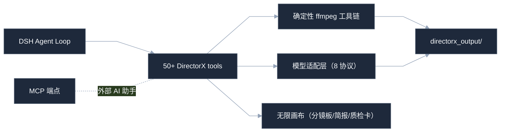

<div align="center">

# dsh-directorx

**DirectorX · AI 视频导演插件**
*AI Film Director Plugin for DeepSeek Harness*

把 DeepSeek Harness 从「会写代码的同事」升级成「会拍片的导演」——
视频生成、智能剪辑、成片质检、无限画布分镜、导演知识库，一个插件全搞定。

<p>
  <a href="https://github.com/LaplaceYoung/dsh-directorx/blob/main/LICENSE"></a>
  
  
  
  
</p>

<table align="center">
  <tr>
    <td align="center"><b>50+</b><br/><sub>agent 工具</sub></td>
    <td align="center"><b>8</b><br/><sub>视频模型协议</sub></td>
    <td align="center"><b>99</b><br/><sub>制作方法论规则</sub></td>
    <td align="center"><b>350+</b><br/><sub>导演知识库文章</sub></td>
    <td align="center"><b>0 元</b><br/><sub>剪辑/质检 API 成本</sub></td>
  </tr>
</table>

<sub>关键词：AI 视频生成 · 文生视频 · 图生视频 · 智能剪辑 · 视频 agent · text-to-video · video agent · storyboard</sub>

</div>

<details>
<summary><b>目录</b></summary>

- [是什么](#what-is-this)
- [为什么选它](#why)
- [和别的方案比](#comparison)
- [制作流水线](#pipeline)
- [架构](#architecture)
- [快速开始](#quick-start)
- [工具速查](#tools)
- [知识包](#knowledge)
- [开发与测试](#development)
- [FAQ](#faq)

</details>

---

<a id="what-is-this"></a>
## 是什么

一句话：**给 DSH 装上影视制作的四肢，而大脑还是 DSH 自己的。** 不抢 agent loop，不塞第二套 runtime，只做五件事：

<table>
  <tr>
    <td width="20%"><b>分析视频</b></td>
    <td>分镜检测、逐镜描述、成片质检报告——全部确定性工具（ffmpeg 驱动，零幻觉）</td>
  </tr>
  <tr>
    <td><b>生成画面</b></td>
    <td>文生图 / 文生视频 / 图生视频 / 首尾帧 / 角色一致性锚点</td>
  </tr>
  <tr>
    <td><b>剪辑成片</b></td>
    <td>时间线渲染、智能精剪、卡点混剪、混音、字幕——免费、可无限重跑</td>
  </tr>
  <tr>
    <td><b>说出声音</b></td>
    <td>TTS 旁白（instructions 表演控制）、音画同出、自动闪避混音</td>
  </tr>
  <tr>
    <td><b>片场知识</b></td>
    <td>99 条制作方法论、7 个风格语法预设、37 个技能、11 套 recipe</td>
  </tr>
</table>

> 想找「AI 视频剪辑」？这里有。想找「AI 短视频成片流水线」？这里有。想找「视频 agent 编排」？
> 这里也有——而且所有剪辑都是本地 ffmpeg 确定性执行：**改计划 = 重渲染，永不重新生成、永不重复花钱。**

<a id="why"></a>
## 为什么选它

| 痛点 | 装上之后 |
|---|---|
| 模型只会说「我无法生成视频」 | DSH 会先查知识库，再直接调用视频工具，产出文件路径 |
| Base URL / API Key 藏在 YAML 深处 | WebUI 设置页像填外卖地址一样填完即用，保存即热更新 |
| 分镜写得像散文 | 99 条方法论把提示词收紧成可生成、可复用的导演指令 |
| 生成完就完事，质量靠玄学 | 成片质检七门 + 帧级 QA + 画布质检卡 |
| 剪辑要花钱、改一处全重来 | 确定性 ffmpeg 剪辑，零 API 成本、幂等可重渲 |
| 想做专业项目却没有流程约束 | brief 意图分诊 + 四道闸门 + 阶段门控提案（先方案后花钱） |

<a id="comparison"></a>
## 和别的方案比

| 方案 | 生成 | 剪辑 | 质检 | 编排 |
|---|---|---|---|---|
| 纯提示词脚手架 | 支持 | 无 | 无 | 无 |
| 独立剪辑软件（剪映/PR） | 无 | 支持 | 部分 | 无 |
| 商业 AI 成片平台 | 支持 | 黑盒 | 黑盒 | 半自动 |
| **dsh-directorx** | **8 协议** | **确定性可重跑** | **七门+帧级** | **agent 自主推导** |

三个原则：**agent 是导演（推导流程）· 画布是分镜板（全程镜像）· ffmpeg 是剪辑台（确定性与免费）**。

<a id="pipeline"></a>
## 制作流水线


<a id="architecture"></a>
## 架构



<a id="quick-start"></a>
## 快速开始

```bash
dsh plugin --profile web add .
dsh web
```

打开 WebUI **Settings → DirectorX**，四个能力独立配置（没有 Key 可切 `mock` 先跑通链路）：

| 能力 | 工具 | 配置方式 | 模型示例 |
|---|---|---|---|
| 视觉 | `directorx_view_image` | `openai-chat` / `mock` | `gpt-4o-mini`、任意兼容 VLM |
| 图像 | `directorx_generate_image` | `openai-images` / `modelverse-tasks` / `mock` | `gpt-image-1`、`doubao-seedream-*` |
| 视频 | `directorx_generate_video` | `openai-videos` / `modelverse-tasks` / `kling` / `kling-v3` / `runway` / `minimax-h3` / `vidu` / `veo` / `mock` | `sora-2`、`kling-3.0`、`gen4.5`、`MiniMax-H3`、`viduq3`、`veo-3.1` |
| 音频 | `directorx_generate_audio` | `openai-tts` / `mock` | `gpt-4o-mini-tts`（支持 instructions） |

<a id="tools"></a>
## 工具速查

**制作四支柱**

| 工具 | 用途 |
|---|---|
| `directorx_brief` | 意图分诊 → 简报 + 一次澄清 + 标题/封面/平台规格卡 |
| `directorx_video_analyze` | 分镜检测 + 代表帧 + 响度（确定性拉片） |
| `directorx_qa` / `_qa_report` | 成片质检七门 + 一键质检卡上画布 |
| `directorx_smart_cut` / `_clip_rank` | LLM 精剪：脚本句匹配字幕条目 / 候选片段排序 |
| `directorx_timeline` / `_edit` | 时间线渲染中枢 / 自然语言剪辑指令 |
| `directorx_audio_sync` | 音画同出：旁白边界 + 自动混音 + 时间锚点 |
| `directorx_storyboard` | 分镜时长规划 + 连续性/运镜校验 |
| `directorx_character_register/list` | 角色一致性锚点库（身份/服装/道具分层） |
| `directorx_style` / `_style_lock` | 风格注入（7 个语法预设）/ 项目风格常量锁 |

**画布（14 个）**：get/add/batch/connect/update/remove/arrange/replace/clear/search/branch/dissolve_group/title/layout_hierarchy + shot_order/summary —— 无限画布是分镜板、简报板、质检板，DSH 与你在 WebUI 看到同一张生产视图。

**其余**：`view_image`、`generate_image/video/audio`、`video_process`（trim/speed/crop/rotate/flip/filters/reverse/freeze）、`video_concat`（硬切/淡入淡出/55 种逐对转场）、`audio_mix`（ducking/targetLufs/durationPolicy）、`video_subtitle`、`video_zoom`、`video_pip`、`audio_beat`、`transcribe_audio`、`probe_media`、`extract_frames`、`preflight`、`propose/proposals/proposal_next/proposal_update`、`task_status/cancel_task`、`edits`、`media_list`、`contact_sheet`、`knowledge_search/read`。

外加 **`/directorx/mcp`**：JSON-RPC 2.0 端点——Claude Desktop / ChatGPT / Cursor 也能驱动这台制片机。

<a id="knowledge"></a>
## 知识包

- **`directorx-methodology`：99 条可执行规则 / 15 领域**——成片结构、提示词工程、镜头语言、导演技法、剪辑节奏、音频混音、字幕设计、叙事后期、VFX、平台运营、配音表演。每条附来源与工具落点，决策与质检引用规则编号。
- **7 个风格语法预设**：wong-kar-wai / wes-anderson / cyberpunk / noir / documentary / commercial / ghibli——锚 + 色盘 + 运动语法 + 负面锁四件套。
- **350+ 篇知识库 + 37 skills + 11 recipes + 3 workflow 模板**（pipeline / talking-video / montage，dryRun 零成本验证编排）。

<a id="development"></a>
## 开发与测试

```bash
npm install
npm run typecheck
npm run build
npm test
```

**85/85 全绿**：8 种视频协议的本地服务器往返、确定性剪辑链真实 ffmpeg 往返、画布语义与类型矩阵、提案状态机、MCP 契约、错误码契约、黄金向量 fixtures。

<a id="faq"></a>
## FAQ

<details>
<summary><b>没有 API Key 能用吗？</b></summary>
能。四个能力都切 <code>mock</code>，先让 DSH 把工具链跑起来；拿到 Key 后回设置页填上即可。
</details>

<details>
<summary><b>支持哪些视频模型？</b></summary>
Sora 2（openai-videos）、可灵（kling legacy + kling-v3 新标准）、Runway Gen-4.5、MiniMax H3、Vidu Q3（多主体参考生）、Google Veo 3.1、豆包 Seedance（modelverse-tasks）——协议全部官方文档一手核实。
</details>

<details>
<summary><b>AI 视频怎么保证多镜头一致性？</b></summary>
<code>directorx_character_register</code> 注册角色锚点 → 生成时自动注入参考图与身份描述；配方法论规则 7（角色绑定三件套）与规则 63（参考池每 6-8 镜刷新）。
</details>

<details>
<summary><b>剪辑会花 API 钱吗？</b></summary>
不会。所有剪辑/混音/字幕/质检都是本地 ffmpeg 确定性执行，免费、精确、可无限重跑。
</details>

<details>
<summary><b>为什么我的模型不听话？</b></summary>
先让 DSH 查 <code>directorx-methodology</code>（99 条规则）与知识库，再检查 mode 是否选对。模型不是不听，是嫌提示词不够导演。
</details>

---

## License

Apache-2.0（见 [`LICENSE`](LICENSE)）。

---

<div align="center">

如果这个插件让你的 DSH 第一次说出「导演，这条过了」，请点个 **Star**；
如果它生成了六个手指的超级英雄，也别慌——那是模型在提醒你：先读知识库，再锁提示词。

**Keep prompting. Keep shooting.**

</div>
